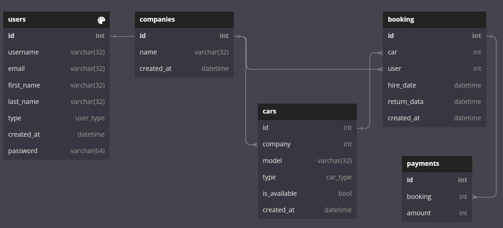

# Car hire management system

This project describes how to create a small car hire management system, where users (customers) can rent and book different types of cars and vans.

## The ERD

The following image describes the ERD, for the full ERD visit this [link](https://dbdiagram.io/d/648c48f302bd1c4a5e999b44)


- Available tables:
  - Users table (customers and employes).
  - Companies table (for car maker companies).
  - cars table.
  - Bookings table (all the booked cars and their schedule).
  - payments table (payment for each car booking)

## Run locally

- create an environment, Then activate it
- Install the requirements from the `requirements.txt` file using pip
- Run the uvicorn server using the following command.
  ```sh
  uvicorn app.main:app --reload
  ```

## Run using docker-compose

- Run the following command in deattached mode using `docker-compose`
  ```sh
  docker-compose up -t --build
  ```

## Usage Instructions

- Make sure to log in and authenticate the user.
- Make sure to configure the following environment variables in postman:
  - `url` : `http://127.0.0.1:8000`
  - `JWT` : Is set automatically when the user first signin.
